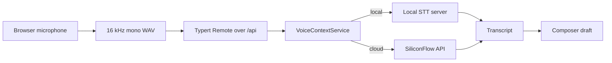

# DeepSeek Harness Voice Context

English | [中文](README.zh.md)

[](LICENSE)   

DeepSeek Harness Voice Context is a voice-enabled distribution of [DeepSeek Harness](https://github.com/deepseek-ai/deepseek-harness). It adds first-party browser recording, trusted Host-side transcription routing, an OpenAI-compatible local speech-to-text server, and a first-use settings flow for choosing cloud or offline models.

> This project inherits DeepSeek Harness's developer-preview status. Interfaces and configuration may change before a stable release.

## Highlights

- Record speech from the Web composer and insert the transcript into the draft without sending a message automatically.
- Choose a cloud API or a fully local offline backend from the Voice-Context settings page.
- Use FunASR `iic/SenseVoiceSmall` for fast Chinese transcription or faster-whisper `small`, `medium`, and `large-v3` for multilingual workloads.
- Route browser audio through the existing Typert Remote and `/api` trust boundary; the browser cannot supply an arbitrary upstream URL.
- Store the cloud API key through the credentials service instead of browser storage or client responses.
- Expose an OpenAI-compatible `POST /v1/audio/transcriptions` endpoint for DeepSeek Harness and other compatible clients.
- Keep one local model resident at a time so switching model sizes does not retain every model in memory.
- Preserve ordinary DeepSeek Harness sessions, plugins, tools, and Web UI behavior.

## Architecture

Voice Context follows the repository's “everything is a plugin” design. The browser owns recording and the user's backend/model preference; the Host owns trusted URLs, credentials, payload limits, and upstream requests.



The Host package is documented in [the Voice Context package README](packages/voice/voice-context/README.md), while [the client package README](packages/client/ui-voice-context/README.md) owns browser recording and settings behavior. The [selectable-backends Agent Note](.agents/notes/implemented/feature/2026-08-14-selectable-voice-transcription-backends.md) records the architectural decision.

## Model choices

| Backend | Model | Primary use | Weight handling |
|---|---|---|---|
| Local FunASR | `iic/SenseVoiceSmall` | Fast Chinese-first transcription on CPU | Downloaded by FunASR on first use |
| Local faster-whisper | `small` | Faster multilingual transcription | Download with `download_models.py` |
| Local faster-whisper | `medium` | Higher multilingual accuracy | Download with `download_models.py` |
| Local faster-whisper | `large-v3` | Highest-quality multilingual Whisper option | Download with `download_models.py` |
| Cloud | `FunAudioLLM/SenseVoiceSmall` | No local model storage; SiliconFlow-hosted inference | Requires `SILICONFLOW_API_KEY` |

Model weights are deliberately excluded from Git. A clone contains the server and download helper, not multi-gigabyte `.pt`, `.bin`, or cache files.

<a id="run"></a>

## Quick start

### Prerequisites

- Node.js `^22.19.0` or `>=24.0.0` and Corepack/pnpm `11.7.0`.
- Python 3.9 or newer for local transcription.
- A microphone-capable browser for voice input.
- A DeepSeek API key for agent conversations; a SiliconFlow key is required only for cloud transcription.

<a id="run-from-source"></a>

### 1. Clone and build

```sh
git clone https://github.com/CharlesLiuZC/deepseek-harness-voice-context.git
cd deepseek-harness-voice-context
corepack enable
corepack prepare pnpm@11.7.0 --activate
pnpm install
pnpm run build
```

### 2. Configure agent credentials

Copy `.env.example` to `.env`, then add `DEEPSEEK_API_KEY`. Add `SILICONFLOW_API_KEY` only when you plan to use the cloud transcription backend.

```powershell
Copy-Item .env.example .env
```

```sh
cp .env.example .env
```

The `.env` file is ignored by Git. Never commit real credentials.

### 3. Start the local transcription server

Windows:

```bat
cd packages\voice\voice-context\local\funasr
start.bat
```

Linux or macOS:

```sh
cd packages/voice/voice-context/local/funasr
bash start.sh
```

The first run creates `.venv`, installs FunASR, CPU torch, and faster-whisper, then starts `http://127.0.0.1:8000`. SenseVoiceSmall downloads through FunASR on its first transcription.

To install one or more faster-whisper models, run the download helper in a second terminal after the virtual environment exists:

```powershell
.venv\Scripts\python download_models.py small
.venv\Scripts\python download_models.py medium large-v3
# Or download every supported Whisper model:
.venv\Scripts\python download_models.py all
```

```sh
.venv/bin/python download_models.py small
.venv/bin/python download_models.py medium large-v3
# Or download every supported Whisper model:
.venv/bin/python download_models.py all
```

Downloaded files stay under `local/funasr/models/`, which is ignored by Git. See [the local server guide](packages/voice/voice-context/local/funasr/README.md) for the API, environment variables, storage, and security details.

### 4. Start DeepSeek Harness Web

From the repository root:

```sh
pnpm dsh web
```

Open `http://127.0.0.1:3080`, enter Settings → Voice-Context, choose Local offline or Cloud API, select a model, and save the voice configuration. The microphone button then uses that selection for each finished recording.

## Configuration

### Backend and model selection

The settings page stores only an allowlisted backend/model pair in browser local storage. Local requests always resolve to `127.0.0.1:<localPort>` on the Host. Cloud requests resolve to the configured non-loopback provider origin, with SiliconFlow as the bundled default.

### Cordis plugin configuration

The Web bundle already mounts both Voice Context packages. A deployment override can configure the Host entry as follows:

```yaml
- id: voice-context
  name: '@deepseek-ai/dsh-voice-context'
  config:
    baseUrl: https://api.siliconflow.cn
    model: FunAudioLLM/SenseVoiceSmall
    language: zh
    localPort: 8000
    apiKeyEnv: SILICONFLOW_API_KEY
```

`baseUrl` configures the cloud provider. Explicit local requests use `localPort` and never send a bearer credential to loopback.

### Local server environment variables

| Variable | Default | Purpose |
|---|---|---|
| `STT_MODEL` | `iic/SenseVoiceSmall` | Model used when a client sends `model=local` |
| `STT_MODEL_ROOT` | `./models/faster-whisper` | Local CTranslate2 model root |
| `STT_DEVICE` | `cpu` | `cpu` or `cuda` inference device |
| `STT_HOST` | `127.0.0.1` | Listening interface |
| `STT_PORT` | `8000` | Listening port |

## OpenAI-compatible API

The local server accepts the standard multipart transcription request and exposes the installed model list:

```sh
curl http://127.0.0.1:8000/v1/audio/transcriptions \
  -F "file=@audio.wav" \
  -F "model=medium" \
  -F "language=zh"

curl http://127.0.0.1:8000/v1/models
curl http://127.0.0.1:8000/health
```

The transcription response includes at least `text` and `model`; faster-whisper responses also report the detected `language`.

## Repository layout

```text
apps/web/                                      Web application
packages/bundle/web-app/                       Default Web plugin composition
packages/voice/voice-context/                  Host STT service and local server
packages/client/ui-voice-context/              Browser microphone and settings UI
packages/voice/voice-context/local/funasr/     Dual-engine OpenAI-compatible STT server
docs/                                          Architecture and subsystem documentation
.agents/notes/                                 Implemented design decisions
```

The repository retains the upstream monorepo because Voice Context is integrated through first-party Cordis packages rather than maintained as a disconnected patch.

## Development and verification

```sh
# Focused Voice Context tests
pnpm exec vitest run \
  packages/voice/voice-context/tests \
  packages/client/ui-voice-context/tests

# Static, build, and documentation checks
pnpm run lint:contracts-ready
pnpm run build
pnpm run doc-sync
```

Use `python -m compileall -q packages/voice/voice-context/local/funasr` to check the local server scripts without loading model weights.

## Security and limitations

- The local server has no authentication and binds to loopback by default. If `STT_HOST=0.0.0.0` exposes it to a LAN, place authentication and transport security in front of it.
- The browser sends base64 audio through JSON; the Host rejects payloads above the configured `maxBytes` limit, which defaults to 25 MiB.
- Cloud transcription sends recorded audio to the configured provider. Local mode keeps transcription audio on the machine.
- Only allowlisted model ids are accepted. Client-supplied filesystem paths and arbitrary remote repository names are rejected.
- The local server serializes inference and keeps one model resident. The first request after switching to `medium` or `large-v3` can take longer while the model loads.

## Contributing

See [CONTRIBUTING.md](CONTRIBUTING.md) for repository workflow and [AGENTS.md](AGENTS.md) for project-specific engineering rules. Bug reports and focused pull requests are welcome in this repository.

## License and acknowledgements

This project is distributed under the [MIT License](LICENSE). It is based on [DeepSeek Harness](https://github.com/deepseek-ai/deepseek-harness), uses [Cordis](https://github.com/cordiverse/cordis), and integrates FunASR/SenseVoice and faster-whisper through their public Python interfaces. Third-party notices are listed in [THIRD_PARTY_NOTICES.md](THIRD_PARTY_NOTICES.md).
