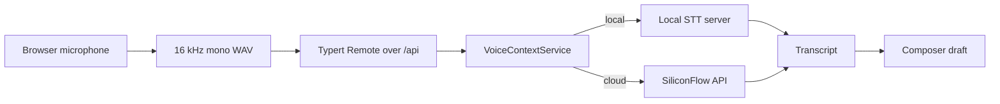

# DeepSeek Harness Voice Context

[English](README.md) | 中文

[](LICENSE)   

DeepSeek Harness Voice Context 是 [DeepSeek Harness](https://github.com/deepseek-ai/deepseek-harness) 的语音功能发行版。它加入了第一方浏览器录音、由宿主控制的可信转写路由、兼容 OpenAI 的本地语音转文字服务，以及可选择云端或离线模型的首次配置流程。

> 本项目沿用 DeepSeek Harness 的开发者预览状态。稳定版本发布前，接口和配置可能发生变化。

## 功能亮点

- 从 Web 输入框录制语音并把转写结果写入草稿，不会自动发送消息。
- 在 Voice-Context 设置页选择云端 API 或完全本地的离线后端。
- 使用 FunASR `iic/SenseVoiceSmall` 完成快速的中文优先转写，或使用 faster-whisper `small`、`medium` 和 `large-v3` 处理多语言内容。
- 通过现有 Typert Remote 和 `/api` 信任边界传输浏览器音频；浏览器不能指定任意上游 URL。
- 通过凭据服务保存云端 API Key，不把它写入浏览器存储，也不在客户端响应中返回。
- 为 DeepSeek Harness 及其他兼容客户端提供兼容 OpenAI 的 `POST /v1/audio/transcriptions` 端点。
- 本地同一时间只驻留一个模型，切换模型大小时不会让所有模型同时占用内存。
- 保留 DeepSeek Harness 原有的会话、插件、工具和 Web UI 行为。

## 技术架构

Voice Context 遵循本仓库「一切皆插件」的设计。浏览器负责录音以及用户的后端／模型偏好，宿主负责可信 URL、凭据、负载限制和上游请求。



[Voice Context 包 README](packages/voice/voice-context/README.md)介绍宿主包，[客户端包 README](packages/client/ui-voice-context/README.md)介绍浏览器录音和设置行为。[可选后端 Agent Note](.agents/notes/implemented/feature/2026-08-14-selectable-voice-transcription-backends.md)记录了架构决策。

## 模型选择

| 后端 | 模型 | 主要用途 | 权重处理方式 |
|---|---|---|---|
| 本地 FunASR | `iic/SenseVoiceSmall` | 在 CPU 上进行快速的中文优先转写 | 首次使用时由 FunASR 下载 |
| 本地 faster-whisper | `small` | 更快的多语言转写 | 使用 `download_models.py` 下载 |
| 本地 faster-whisper | `medium` | 更高的多语言准确率 | 使用 `download_models.py` 下载 |
| 本地 faster-whisper | `large-v3` | 质量最高的多语言 Whisper 选项 | 使用 `download_models.py` 下载 |
| 云端 | `FunAudioLLM/SenseVoiceSmall` | 不在本地保存模型；由 SiliconFlow 托管推理 | 需要 `SILICONFLOW_API_KEY` |

Git 会明确排除模型权重。克隆结果包含服务端和下载工具，不包含数 GB 的 `.pt`、`.bin` 或缓存文件。

<a id="run"></a>

## 快速开始

### 环境要求

- Node.js `^22.19.0` 或 `>=24.0.0`，以及 Corepack/pnpm `11.7.0`。
- 本地转写需要 Python 3.9 或更高版本。
- 使用语音输入需要支持麦克风的浏览器。
- agent 对话需要 DeepSeek API Key；只有云端转写需要 SiliconFlow Key。

<a id="run-from-source"></a>

### 1. 克隆并构建

```sh
git clone https://github.com/CharlesLiuZC/deepseek-harness-voice-context.git
cd deepseek-harness-voice-context
corepack enable
corepack prepare pnpm@11.7.0 --activate
pnpm install
pnpm run build
```

### 2. 配置 agent 凭据

把 `.env.example` 复制为 `.env`，然后填写 `DEEPSEEK_API_KEY`。只有准备使用云端转写后端时才需要填写 `SILICONFLOW_API_KEY`。

```powershell
Copy-Item .env.example .env
```

```sh
cp .env.example .env
```

Git 会忽略 `.env` 文件。不要提交真实凭据。

### 3. 启动本地转写服务

Windows：

```bat
cd packages\voice\voice-context\local\funasr
start.bat
```

Linux 或 macOS：

```sh
cd packages/voice/voice-context/local/funasr
bash start.sh
```

首次运行会创建 `.venv`，安装 FunASR、CPU 版 torch 和 faster-whisper，然后在 `http://127.0.0.1:8000` 启动服务。SenseVoiceSmall 会在第一次转写时通过 FunASR 下载。

如需安装一个或多个 faster-whisper 模型，请在虚拟环境创建后打开第二个终端运行下载工具：

```powershell
.venv\Scripts\python download_models.py small
.venv\Scripts\python download_models.py medium large-v3
# Or download every supported Whisper model:
.venv\Scripts\python download_models.py all
```

```sh
.venv/bin/python download_models.py small
.venv/bin/python download_models.py medium large-v3
# Or download every supported Whisper model:
.venv/bin/python download_models.py all
```

下载的文件保存在 `local/funasr/models/` 下，Git 会忽略该目录。[本地服务指南](packages/voice/voice-context/local/funasr/README.md)详细说明了 API、环境变量、存储位置和安全事项。

### 4. 启动 DeepSeek Harness Web

回到仓库根目录：

```sh
pnpm dsh web
```

打开 `http://127.0.0.1:3080`，进入「设置 → Voice-Context」，选择「本地离线」或「云端 API」，选择模型并保存语音配置。此后每次录音结束，麦克风按钮都会使用这个选择。

## 配置参考

### 后端和模型选择

设置页只在浏览器本地存储中保存白名单内的后端／模型组合。本地请求始终由宿主解析到 `127.0.0.1:<localPort>`。云端请求会解析到已配置的非回环提供方地址，内置默认提供方为 SiliconFlow。

### Cordis 插件配置

Web 组合包已经挂载两个 Voice Context 包。部署覆盖层可以按下面的方式配置宿主项：

```yaml
- id: voice-context
  name: '@deepseek-ai/dsh-voice-context'
  config:
    baseUrl: https://api.siliconflow.cn
    model: FunAudioLLM/SenseVoiceSmall
    language: zh
    localPort: 8000
    apiKeyEnv: SILICONFLOW_API_KEY
```

`baseUrl` 配置云端提供方。明确选择本地后端的请求使用 `localPort`，并且不会向回环地址发送 Bearer 凭据。

### 本地服务环境变量

| 变量 | 默认值 | 用途 |
|---|---|---|
| `STT_MODEL` | `iic/SenseVoiceSmall` | 客户端发送 `model=local` 时使用的模型 |
| `STT_MODEL_ROOT` | `./models/faster-whisper` | 本地 CTranslate2 模型根目录 |
| `STT_DEVICE` | `cpu` | `cpu` 或 `cuda` 推理设备 |
| `STT_HOST` | `127.0.0.1` | 监听网卡地址 |
| `STT_PORT` | `8000` | 监听端口 |

## OpenAI 兼容 API

本地服务接受标准 multipart 转写请求，并提供已安装模型列表：

```sh
curl http://127.0.0.1:8000/v1/audio/transcriptions \
  -F "file=@audio.wav" \
  -F "model=medium" \
  -F "language=zh"

curl http://127.0.0.1:8000/v1/models
curl http://127.0.0.1:8000/health
```

转写响应至少包含 `text` 和 `model`；faster-whisper 响应还会报告检测到的 `language`。

## 仓库结构

```text
apps/web/                                      Web application
packages/bundle/web-app/                       Default Web plugin composition
packages/voice/voice-context/                  Host STT service and local server
packages/client/ui-voice-context/              Browser microphone and settings UI
packages/voice/voice-context/local/funasr/     Dual-engine OpenAI-compatible STT server
docs/                                          Architecture and subsystem documentation
.agents/notes/                                 Implemented design decisions
```

本仓库保留上游 monorepo，因为 Voice Context 通过第一方 Cordis 包集成，而不是作为脱离主工程的补丁维护。

## 开发与验证

```sh
# Focused Voice Context tests
pnpm exec vitest run \
  packages/voice/voice-context/tests \
  packages/client/ui-voice-context/tests

# Static, build, and documentation checks
pnpm run lint:contracts-ready
pnpm run build
pnpm run doc-sync
```

运行 `python -m compileall -q packages/voice/voice-context/local/funasr` 可以在不加载模型权重的情况下检查本地服务脚本。

## 安全与限制

- 本地服务不提供鉴权，并默认绑定回环地址。如果设置 `STT_HOST=0.0.0.0` 把服务暴露到局域网，请在前方增加鉴权和传输加密。
- 浏览器通过 JSON 发送 base64 音频；宿主会拒绝超过 `maxBytes` 配置的负载，默认上限为 25 MiB。
- 云端转写会把录音发送给已配置的提供方。本地模式会在本机完成语音转写。
- 服务只接受白名单模型 id，拒绝客户端提供的文件系统路径和任意远程仓库名。
- 本地服务串行执行推理，并且只驻留一个模型。切换到 `medium` 或 `large-v3` 后，首次请求会因模型加载而耗时更长。

## 参与贡献

[CONTRIBUTING.md](CONTRIBUTING.md)介绍仓库工作流，[AGENTS.md](AGENTS.md)介绍本项目的工程规则。欢迎在此仓库提交 bug 报告和范围明确的 Pull Request。

## 许可证与致谢

本项目使用 [MIT License](LICENSE) 发布。项目基于 [DeepSeek Harness](https://github.com/deepseek-ai/deepseek-harness)，使用 [Cordis](https://github.com/cordiverse/cordis)，并通过公开 Python 接口集成 FunASR/SenseVoice 与 faster-whisper。第三方声明见 [THIRD_PARTY_NOTICES.md](THIRD_PARTY_NOTICES.md)。
